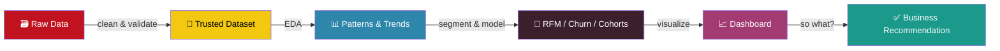

<p align="center">
  
</p>

<p align="center">
  <a href="https://linkedin.com/in/alain-kuriakose-023627369"></a>
  <a href="mailto:alainkuriakose30@gmail.com"></a>
  
</p>

<div align="center">

```
┌─────────────────────────────────────────────────┐
│  alain@kerala:~$ whoami                          │
│  data_analyst — builds order out of raw tables   │
│                                                   │
│  alain@kerala:~$ cat mission.txt                 │
│  Take messy, unstructured data → make it tell    │
│  a story someone can actually act on.            │
└─────────────────────────────────────────────────┘
```

</div>

---

### 🔬 How I approach a dataset



---

### 👋 About Me

- 🎓 B.Tech in Computer Science and Design — Vimal Jyothi Engineering College, May 2026
- 🔍 The part of analytics I like most: the *forensic* part — chasing down why the numbers don't add up
- 📊 Recent build: an RFM + churn model that sorted 800+ customers into segments worth treating differently
- 📝 Co-authored a peer-reviewed paper presented at **ICSIE 2026** (multimodal ML for early Parkinson's detection)
- 🌱 Currently leveling up: advanced SQL and dashboard storytelling, via freelance data research work
- ⚡ Ask me about: RFM segmentation, cohort retention, or why your pivot table is quietly lying to you

---

### 🧰 Tech Stack

<p align="center">

</p>

<table>
<tr><td><b>SQL</b></td><td></td></tr>
<tr><td><b>Python (Pandas/NumPy)</b></td><td></td></tr>
<tr><td><b>Power BI / Tableau</b></td><td></td></tr>
<tr><td><b>Excel</b></td><td></td></tr>
<tr><td><b>Machine Learning</b></td><td></td></tr>
</table>


---

### 📌 Featured Projects

<table>
<tr>
<td width="50%" valign="top">

#### 🛒 [Retail Sales Performance & Customer Churn Analysis](https://github.com/alainkuriakose/retail-sales-churn-analysis)
Cleaned 23K+ transactions, built RFM segmentation, modeled 90-day churn, mapped cohort retention — closed with 4 concrete retention recommendations, not just charts.

`Python` `Pandas` `Seaborn` `RFM`

</td>
<td width="50%" valign="top">

#### 🔍 Transaction Consistency Checker & Auditor
Automated auditing tool that cleans, validates, and flags anomalies in high-volume financial logs, exporting reconciliation-ready Excel reports.

`Python` `SQL` `Excel` `Pandas`

</td>
</tr>
<tr>
<td width="50%" valign="top">

#### 🧠 Early Detection of Parkinson's Disease
Multimodal ML pipeline combining brain MRI scans and voice acoustic features for diagnostic classification. Presented at ICSIE 2026.

`PyTorch` `Scikit-Learn` `CNN`

</td>
<td width="50%" valign="top">

#### 📚 Automated Concept Extractor & Question Generator
Text-processing tool that parses unstructured study notes and auto-generates questions using rule-based pattern matching.

`Python` `File Handling`

</td>
</tr>
</table>

---

### 🏆 Trophies

<p align="center">
  
</p>

### 📈 GitHub Stats

<p align="center">
  
  
</p>

<p align="center">
  
</p>

<p align="center">
  
</p>

<!--
  🐍 Optional: contribution snake animation
  Uncomment the line below AFTER setting up the GitHub Action described
  in snake-workflow.yml (included alongside this file). It animates your
  contribution graph as a snake eating your commits.

  
-->

---

<p align="center">
  
</p>

<p align="center">
  📫 <b>alainkuriakose30@gmail.com</b> — open to Data Analyst roles & collaborations
</p>


